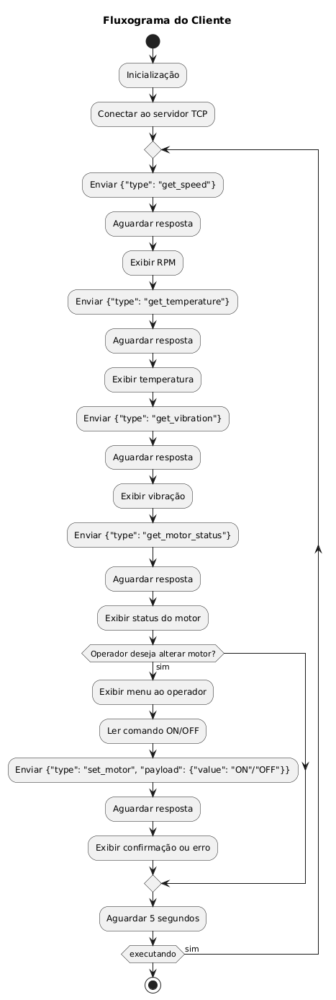
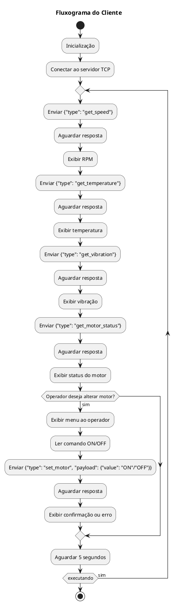
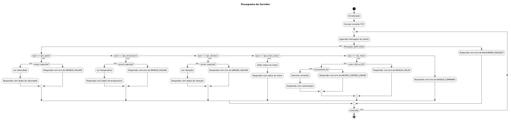
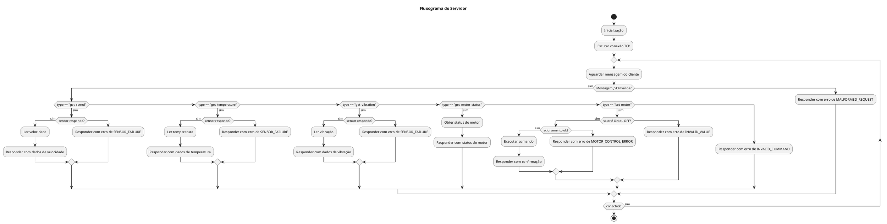

# 📘 Protocolo JSON sobre TCP — Controle e Monitoramento de Motor

Alunos: Luís Felipe Borsoi & Felipe Drumm

---

## 🧭 Contexto da Aplicação

Este protocolo foi projetado para permitir a comunicação entre um sistema supervisor (cliente) e um dispositivo embarcado (servidor) responsável pelo controle de um motor elétrico. A comunicação ocorre diretamente sobre a camada de transporte TCP, utilizando mensagens JSON com delimitador `\n`.

### ⚙️ Por que esse protocolo?
- **Simplicidade:** JSON é legível e fácil de implementar em múltiplas linguagens.
- **Leveza:** TCP puro evita a sobrecarga de protocolos como HTTP.
- **Modularidade:** Cada `type` representa uma ação clara e independente.
- **Delimitação fácil:** O uso de `\n` permite separação segura das mensagens em fluxo contínuo de bytes.

---

## 📡 Tipos de Requisições e Respostas

| `type` da Requisição/Resposta | Objetivo                                          |
| ----------------------------- | ------------------------------------------------- |
| `get_speed`                   | Solicita/Responde velocidade do eixo (sensor 1)   |
| `get_temperature`             | Solicita/Responde temperatura do motor (sensor 2) |
| `get_vibration`               | Solicita/Responde vibração mecânica (sensor 3)    |
| `get_motor_status`            | Solicita/Responde status atual do motor (ON/OFF)  |
| `set_motor`                   | Aciona ou desliga o motor e retorna o novo estado |

---

## 🔄 Tabela de Payloads

### ✅ **Requisições**

| Tipo (`type`)      | Campos em `payload`                         | Descrição                                      |
| ------------------ | ------------------------------------------- | ---------------------------------------------- |
| `get_speed`        | `{}`                                        | Nenhum campo. Apenas solicita a leitura.       |
| `get_temperature`  | `{}`                                        | Nenhum campo. Apenas solicita a leitura.       |
| `get_vibration`    | `{}`                                        | Nenhum campo. Apenas solicita a leitura.       |
| `get_motor_status` | `{}`                                        | Nenhum campo. Apenas solicita o status.        |
| `set_motor`        | `{ "value": "ON" }` ou `{ "value": "OFF" }` | Define se o motor deve ser ligado ou desligado |

---

### 🟩 **Respostas**

| Tipo (`type`)      | Campos em `payload`                                | Exemplo                                |
| ------------------ | -------------------------------------------------- | -------------------------------------- |
| `get_speed`        | `{ "rpm": <float> }`                               | `{ "rpm": 1450.5 }`                    |
| `get_temperature`  | `{ "temperature": <float>, "unit": "C" }`          | `{ "temperature": 68.2, "unit": "C" }` |
| `get_vibration`    | `{ "rms": <float>, "unit": "m/s2" }`               | `{ "rms": 1.42, "unit": "m/s2" }`      |
| `get_motor_status` | `{ "motor": "ON" }`                                | `{ "motor": "OFF" }`                   |
| `set_motor`        | `{ "status": "success", "motor": "ON" }`           | Confirma comando `set_motor`           |
| `error`            | `{ "code": "<code>", "message": "<description>" }` | Veja tabela de erros abaixo            |

---

## ❌ Tabela de Erros

| Código (`code`)       | Descrição                                                 |
| --------------------- | --------------------------------------------------------- |
| `INVALID_COMMAND`     | Campo `type` inexistente ou não reconhecido               |
| `MALFORMED_REQUEST`   | JSON inválido ou campos faltando                          |
| `INVALID_VALUE`       | Valor de campo `value` incorreto em `set_motor`           |
| `SENSOR_FAILURE`      | Falha de leitura nos sensores (velocidade, temperatura ou vibração) |
| `MOTOR_CONTROL_ERROR` | Erro interno ao tentar ligar/desligar o motor             |
| `INTERNAL_ERROR`      | Falha genérica do servidor                                |

---

## 🧪 Exemplos

### 🔹 Leitura de velocidade (requisição + resposta)

**Requisição:**
```json
{"type":"get_speed","payload":{}}
```

**Resposta:**
```json
{"type":"get_speed","payload":{"rpm":1480.75}}
```

---

### 🔹 Comando para ligar motor

**Requisição:**
```json
{"type":"set_motor","payload":{"value":"ON"}}
```

**Resposta:**
```json
{"type":"set_motor","payload":{"status":"success","motor":"ON"}}
```

---

### 🔹 Resposta de erro

```json
{"type":"error","payload":{"code":"INVALID_VALUE","message":"Expected ON or OFF in 'value'"}}
```

---

## ⚙️ Premissas de Funcionamento

- O cliente é iniciado automaticamente e se conecta ao servidor via TCP.
- O cliente envia periodicamente (a cada 5 segundos) quatro requisições:
  - Leitura de velocidade do motor (`get_speed`)
  - Leitura de temperatura do motor (`get_temperature`)
  - Leitura de vibração do motor (`get_vibration`)
  - Leitura de status do motor (`get_motor_status`)
- O operador do cliente pode optar por enviar comandos `set_motor` manualmente.
- O servidor fica em loop escutando requisições e respondendo conforme o campo `type`.
- A comunicação ocorre por mensagens JSON delimitadas por `\n`.

---

## 🔄 Fluxograma do Cliente (PlantUML)





---

## 🔌 Fluxograma do Servidor (PlantUML)



